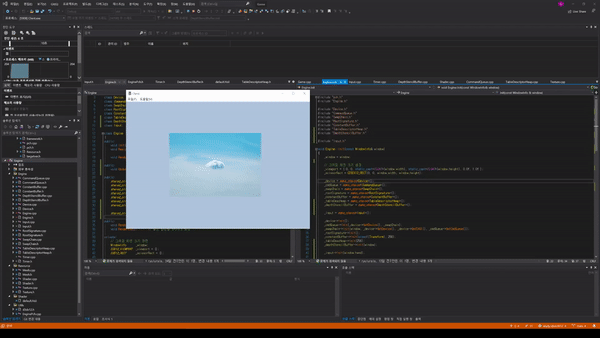
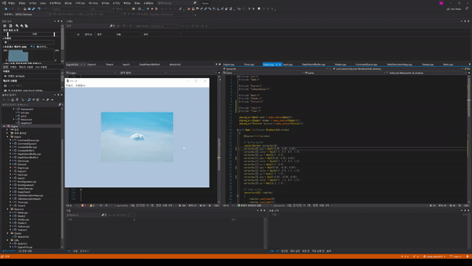

Table of Contents

- [Input과 Timer](#input과-timer)
- [Material](#material)
- [Component](#component)
- [Scene](#scene)

---

## Input과 Timer

- 입력을 받고 시간에 비례한 거리를 이동하기 위해서 필요하다.
- 대부분 상용 엔진에서 전역으로 사용한다.

### Input 추가: Unity Engine Style

- Input.h

  ```cpp
  #pragma once

  enum class KEY_TYPE
  {
      // VK~: Window 제공
      UP = VK_UP,
      DOWN = VK_DOWN,
      LEFT = VK_LEFT,
      RIGHT = VK_RIGHT,

      W = 'W',
      A = 'A',
      S = 'S',
      D = 'D',
  };

  enum class KEY_STATE
  {
      NONE,
      PRESS,
      DOWN,
      UP,
      END
  };

  enum
  {
      KEY_TYPE_COUNT = static_cast<int32>(UINT8_MAX + 1),
      KEY_STATE_COUNT = static_cast<int32>(KEY_STATE::END),
  };

  class Input
  {
  public:
      void Init(HWND hwnd);
      void Update();

      // 누르고 있을 때
      bool GetButton(KEY_TYPE key) const { return GetState(key) == KEY_STATE::PRESS; }
      // 처음 눌렀을 때
      bool GetButtonDown(KEY_TYPE key) const { return GetState(key) == KEY_STATE::DOWN; }
      // 처음 눌렀다 뗐을 때
      bool GetButtonUp(KEY_TYPE key) const { return GetState(key) == KEY_STATE::UP; }

  private:
      inline KEY_STATE GetState(KEY_TYPE key) const { return _states[static_cast<uint8>(key)]; }

  private:
      HWND _hwnd;
      vector<KEY_STATE> _states;
  };

  ```

- Input.cpp

  ```cpp
  #include "pch.h"
  #include "Input.h"

  void Input::Init(HWND hwnd)
  {
      _hwnd = hwnd;
      _states.resize(KEY_TYPE_COUNT, KEY_STATE::NONE);
  }

  void Input::Update()
  {
      // 현재 활성화된 윈도우 창인지 확인
      HWND hwnd = ::GetActiveWindow();
      if (_hwnd != hwnd)
      {
          for (uint32 key = 0; key < KEY_TYPE_COUNT; key++)
              _states[key] = KEY_STATE::NONE;

          return;
      }

      BYTE asciiKeys[KEY_TYPE_COUNT] = {};
      if (::GetKeyboardState(asciiKeys) == false)
          return;

      for (uint32 key = 0; key < KEY_TYPE_COUNT; key++)
      {
          // 키가 눌려 있으면 true
          if (asciiKeys[key] & 0x80)  // Window API
          {
              KEY_STATE& state = _states[key];

              // 이전 프레임에 키를 누른 상태라면 PRESS
              if (state == KEY_STATE::PRESS || state == KEY_STATE::DOWN)
                  state = KEY_STATE::PRESS;
              else
                  state = KEY_STATE::DOWN;
          }
          else
          {
              KEY_STATE& state = _states[key];

              // 이전 프레임에 키를 누른 상태라면 UP
              if (state == KEY_STATE::PRESS || state == KEY_STATE::DOWN)
                  state = KEY_STATE::UP;
              else
                  state = KEY_STATE::NONE;
          }
      }
  }

  ```

- Engine.h

  ```cpp
  ...
  class Input;

  class Engine
  {
  ...

  public:
      void Update();

  public:
      ...
      shared_ptr<DepthStencilBuffer> GetDepthStencilBuffer() const { return _depthStencilBuffer; }

      shared_ptr<Input> GetInput() const { return _input; }

  public:
      void RenderBegin();   // Command Queue에 요청 사항 넣기
      void RenderEnd();     // 쌓은 일감을 GPU에게 넘김

  private:
      ...
      shared_ptr<DepthStencilBuffer> _depthStencilBuffer;

      shared_ptr<Input> _input;
  };

  ```

- Engine.cpp

  ```cpp
  ...
  #include "Input.h"

  void Engine::Init(const WindowInfo& window)
  {
      ...
      _input = make_shared<Input>();

      ...

      _input->Init(window.hwnd);

      ResizeWindow(window.width, window.height);
  }

  void Engine::Update()
  {
      _input->Update();
  }

  ...
  ```

### Input 결과 확인

- EnginePch.h

  > Input은 자주 사용하므로 Define 해준다.

  ```cpp
  ...
  #define DEVICE            GEngine->GetDevice()->GetDevice()
  #define CMD_LIST          GEngine->GetCmdQueue()->GetCmdList()
  #define RESOURCE_CMD_LIST GEngine->GetCmdQueue()->GetResourceCmdList()
  #define ROOT_SIGNATURE    GEngine->GetRootSignature()->GetSignature()

  #define INPUT             GEngine->GetInput()
  ...
  ```

- Game.cpp

  > Engine's Update 추가

  ```cpp
  ...
  #include "Input.h"

  ...

  void Game::Update()
  {
      GEngine->Update();

      GEngine->RenderBegin();

      shader->Update();

      {
          static Transform t = {};
          if (INPUT->GetButton(KEY_TYPE::W))
              t.offset.y += 1.f * 0.001;      // 원래는 deltaTime을 곱해야 함
          if(INPUT->GetButton(KEY_TYPE::S))
              t.offset.y -= 1.f * 0.001;
          if(INPUT->GetButton(KEY_TYPE::A))
              t.offset.x -= 1.f * 0.001;
          if(INPUT->GetButton(KEY_TYPE::D))
              t.offset.x += 1.f * 0.001;

          mesh->SetTransform(t);
          mesh->SetTexture(texture);
          mesh->Render();
      }

      //GEngine->Render();

      GEngine->RenderEnd();
  }
  ```

- 결과

  |    `W`, `A`, `S`, `D` 로 메시 이동    |
  | :-----------------------------------: |
  |  |

### Timer 추가

- Timer.h

  ```cpp
  #pragma once
  class Timer
  {
  public:
      void Init();
      void Update();

      uint32 GetFps() const { return _fps; }
      float GetDeltaTime()const { return _deltaTime; }

  private:
      uint64 _frequency = 0;
      uint64 _prevCount = 0;
      float _deltaTime = 0.f;   // 이전 프레임에서 현재 프레임까지 걸린 시간

  private:
      // 프레임 계산 용도
      uint32 _frameCount = 0;
      float _frameTime = 0.f;
      uint32 _fps = 0;

  };

  ```

- Timer.cpp

  ```cpp
  #include "pch.h"
  #include "Timer.h"

  void Timer::Init()
  {
      ::QueryPerformanceFrequency(reinterpret_cast<LARGE_INTEGER*>(&_frequency));
      ::QueryPerformanceCounter(reinterpret_cast<LARGE_INTEGER*>(&_prevCount));   // CPU 클럭
  }

  void Timer::Update()
  {
      uint64 currentCount;
      ::QueryPerformanceCounter(reinterpret_cast<LARGE_INTEGER*>(&currentCount));

      _deltaTime = (currentCount - _prevCount) / static_cast<float>(_frequency);
      _prevCount = currentCount;

      _frameCount++;
      _frameTime += _deltaTime;

      // 1초마다 갱신
      if (_frameTime > 1.f)
      {
          _fps = static_cast<uint32>(_frameCount / _frameTime);

          _frameTime = 0.f;
          _frameCount = 0;
      }
  }

  ```

- Engine.h

  ```cpp
  ...
  class Timer;

  class Engine
  {
  ...

  public:
      void Update();

  public:
      ...

      shared_ptr<Input> GetInput() const { return _input; }
      shared_ptr<Timer> GetTimer() const { return _timer; }

  ...

  private:
      void ShowFps();

  private:
      ...

      shared_ptr<Timer> _timer;
  };

  ```

- Engine.cpp

  ```cpp
  ...
  #include "Timer.h"

  void Engine::Init(const WindowInfo& window)
  {
      ...

      _input = make_shared<Input>();
      _timer = make_shared<Timer>();

      ...

      _input->Init(window.hwnd);
      _timer->Init();

      ResizeWindow(window.width, window.height);
  }

  ...

  void Engine::Update()
  {
      _input->Update();
      _timer->Update();

      ShowFps();
  }

  ...

  void Engine::ShowFps()
  {
      uint32 fps = _timer->GetFps();

      WCHAR text[100] = L"";
      ::wsprintf(text, L"FPS: %d", fps);

      ::SetWindowText(_window.hwnd, text);
  }

  ```

### Timer 결과 확인

- EnginePch.cpp

  > #Define DeltaTime

  ```cpp
  ...

  #define INPUT       GEngine->GetInput()
  #define DELTA_TIME  GEngine->GetTimer()->GetDeltaTime()

  ...
  ```

- Game.cpp

  ```cpp
  ...
  #include "Timer.h"

  ...

  void Game::Update()
  {
      GEngine->Update();

      GEngine->RenderBegin();

      shader->Update();

      {
          static Transform t = {};
          if (INPUT->GetButton(KEY_TYPE::W))
              t.offset.y += 1.f * DELTA_TIME;
          if(INPUT->GetButton(KEY_TYPE::S))
              t.offset.y -= 1.f * DELTA_TIME;
          if(INPUT->GetButton(KEY_TYPE::A))
              t.offset.x -= 1.f * DELTA_TIME;
          if(INPUT->GetButton(KEY_TYPE::D))
              t.offset.x += 1.f * DELTA_TIME;

          mesh->SetTransform(t);
          mesh->SetTexture(texture);
          mesh->Render();
      }

      //GEngine->Render();

      GEngine->RenderEnd();
  }

  ```

- 결과

  | 시간에 따라 동일하게 움직임(거리 = 속도 x 시간) |
  | :---------------------------------------------: |
  |            |

---

## Material

---

## Component

---

## Scene

---
