Table of Contents

- [프로젝트 설정](#프로젝트-설정)
- [장치 초기화](#장치-초기화)
- [삼각형 띄우기](#삼각형-띄우기)
- [Constant Buffer](#constant-buffer)
- [Root Signature](#root-signature)
- [Index Buffer](#index-buffer)
- [Texture Mapping](#texture-mapping)
- [Depth Stencil View](#depth-stencil-view)

---

## 프로젝트 설정

1. 프로젝트 생성

   |                Window 데스크톱 애플리케이션 프로젝트 생성                 |          Project - `Client`, Solution - `Game`          |
   | :-----------------------------------------------------------------------: | :-----------------------------------------------------: |
   | 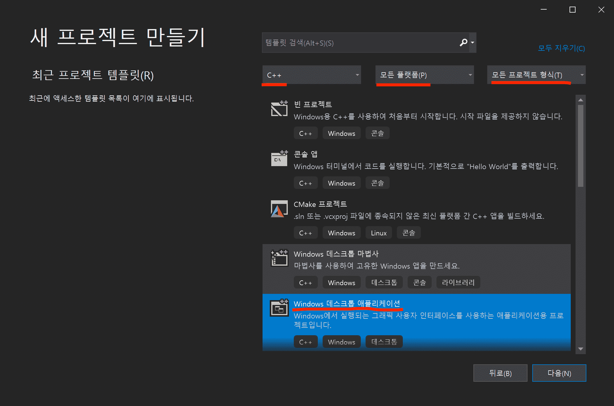 | 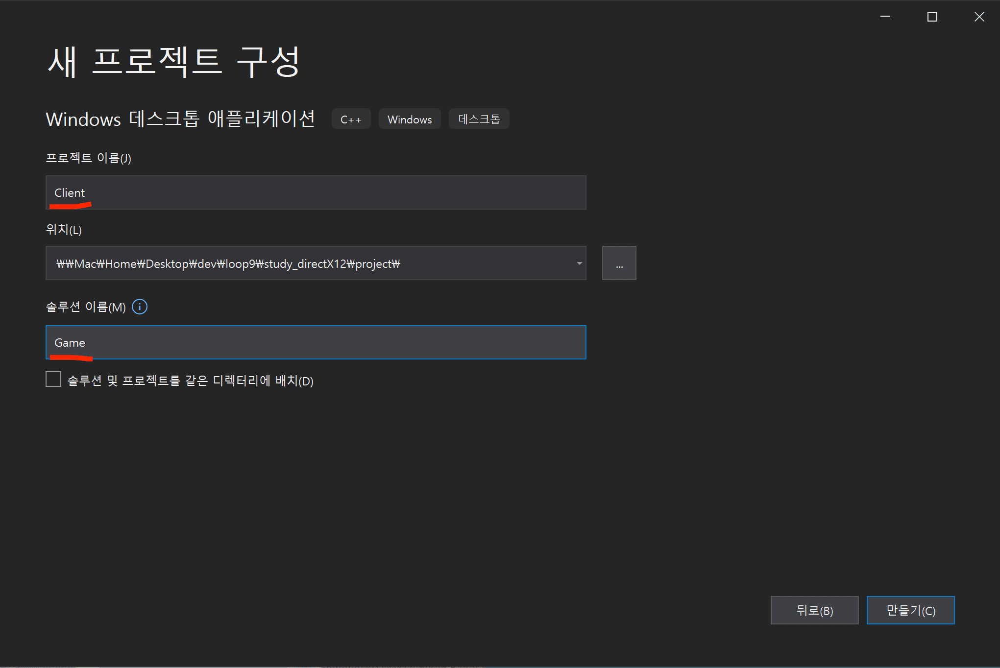 |

2. 입력이 없어도 프로그램이 계속 실행되도록 수정

   > 게임은 입력이 없어도 Main 함수가 무한루프로 호출되는 프로그램이다.

   - Client.cpp

     ```cpp
     ...

     int APIENTRY wWinMain(_In_ HINSTANCE hInstance,
                         _In_opt_ HINSTANCE hPrevInstance,
                         _In_ LPWSTR    lpCmdLine,
                         _In_ int       nCmdShow)
     {
         ...

         MSG msg;    // 키보드, 마우스 등의 입력을 메시지로 받는다.

         // 기본 메시지 루프입니다:
         while (true)
         {
             // 메시지 있는지 확인하고 큐에서 꺼내옴
             if (PeekMessage(&msg, nullptr, 0, 0, PM_REMOVE)) // PM_REMOVE: 메시지 큐에서 꺼내오고 Remove
             {
                 if (msg.message == WM_QUIT)  // WM_QUIT: 프로그램 종료할 때 사용하는 메시지
                     break;   // 게임 종료

                 if (!TranslateAccelerator(msg.hwnd, hAccelTable, &msg))
                 {
                     TranslateMessage(&msg);
                     DispatchMessage(&msg);
                 }
             }

             // @TODO
             // 게임 로직

         }

         return (int) msg.wParam;    // 기본 메시지 루프입니다:
     }

     ...
     ```

3. 64bit 환경 프로그램으로 설정

   > 해당 게임은 64bit로 실행됨

   |           64bit 환경 프로그램 실행으로 변경           |
   | :---------------------------------------------------: |
   | 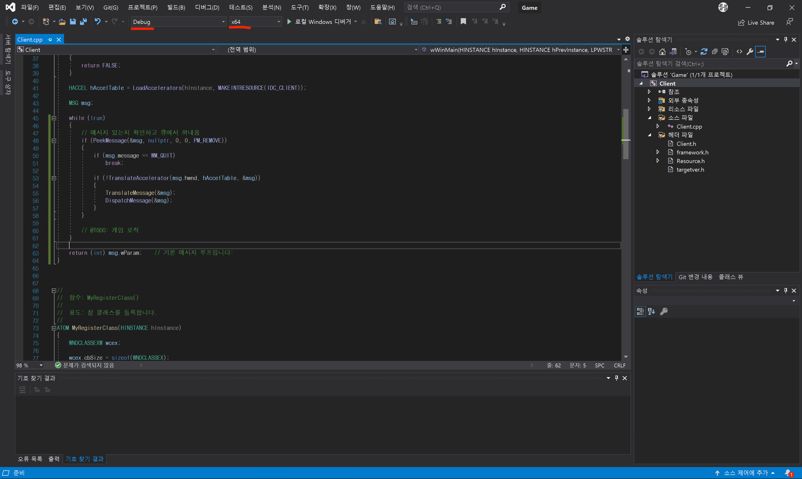 |

4. PCH(Pre-Compiled Header) 사용

   > 공용으로 미리 한 번 컴파일된 헤더를 꺼내서 사용

   1. "미리 컴파일된 헤더 사용" 설정

      > 모든 구성 - 모든 플랫폼
      >
      > 미리 컴파일된 헤더 사용
      >
      > 헤더 파일명: `pch.h`

      |            과정             |
      | :-------------------------: |
      |  |

   2. 폴더 정리

      > 헤더 파일과 소스 파일을 폴더로 구분 X
      >
      > `Game`, `Utils` 필터 생성

      |                         폴더 정리                         |
      | :-------------------------------------------------------: |
      | 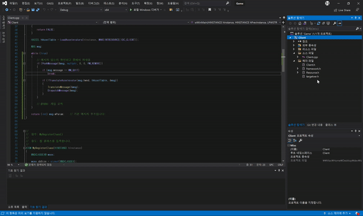 |

   3. pch.h 생성

      |     pch.cpp 생성 후 속성 설정     |
      | :-------------------------------: |
      | 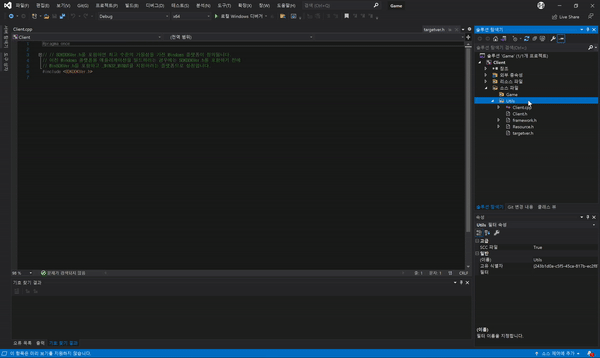 |

      - pch.h

        ```cpp
        #pragma once

        #include <vector>
        #include <memory>

        using namespace std;
        ```

      - Client.cpp

        > 앞으로 클래스를 만들 때는 `#include "pch.h"`가 붙지만, 미리 컴파일된 헤더 설정 전에 만들어진 Client.cpp 경우에는 위에 선언해줘야 성공적으로 빌드가 된다.

        ```cpp
        #include "pch.h"  // 제일 상단에 선언: 미리 컴파일된 헤더를 사용하겠다.

        ...
        ```

5. Client의 Main-Loop에서 Game 로직 실행

   - Game 클래스 생성

     > 게임과 관련된 코드를 Game 클래스에 작성한다.

     |                클래스 생성 과정                 |
     | :---------------------------------------------: |
     | 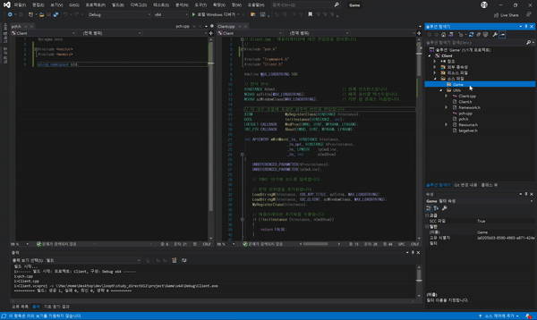 |

     - Game.h

       ```cpp
       #pragma once
       class Game
       {
       public:
           void Init();
           void Update();
       };

       ```

     - Game.cpp

       ```cpp
       #include "pch.h"
       #include "Game.h"

       void Game::Init()
       {
       }

       void Game::Update()
       {
       }

       ```

   - Client.cpp

     > Main-Loop에서 Game 로직 실행하도록 설정
     >
     > 메뉴-바를 안 보이도록 설정

     ```cpp
     ...

     #include "Game.h"

     ...

     int APIENTRY wWinMain(_In_ HINSTANCE hInstance,
                         _In_opt_ HINSTANCE hPrevInstance,
                         _In_ LPWSTR    lpCmdLine,
                         _In_ int       nCmdShow)
     {
         ...

         // 게임 생성 후 초기화
         unique_ptr<Game> game = make_unique<Game>();    // Smart-pointer 사용
         game->Init();

         while (true)
         {
             ...

             // 게임 로직
             game->Update();
         }

         return (int) msg.wParam;    // 기본 메시지 루프입니다:
     }

     ATOM MyRegisterClass(HINSTANCE hInstance)
     {
         ...

         wcex.lpszMenuName = nullptr;      // 메뉴바 안 보이도록 설정

         ...
     }

     ...
     ```

6. Engine 라이브러리 생성

   - 정적 라이브러리 vs 동적 라이브러리

     |    정적 라이브러리(`*.lib`)     |         동적 라이브러리(`*.dll`)          |
     | :-----------------------------: | :---------------------------------------: |
     | 프로젝트 자체에 라이브러리 연결 | 프로그램 실행 시점에 외부 라이브러리 연결 |

   - `Engine` 정적 라이브러리 생성

     > 실행 파일과 묶여서 관리되는 이유로 따로 dll을 관리할 필요가 없어서 정적 라이브러리로 선택!
     >
     > 폴더 정리: 1) 헤더파일 - 소스파일 폴더 구분 X, 리소스 폴더 삭제

     |    정적 라이브러리 생성, Project - `Engine`     |
     | :---------------------------------------------: |
     | 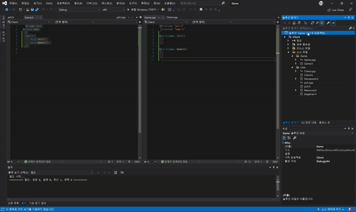 |

   - 폴더 정리

     - Engine, Resource, Utils 필터 생성
     - framework.h 내용 pch.h로 이전 후 삭제

       > framework.h에 1줄 내용 밖에 없어서 이전한다.

       - pch.h

       ```cpp
       ...

       // 여기에 미리 컴파일하려는 헤더 추가
       // #include "framework.h"

       // from. framework.h
       #define WIN32_LEAN_AND_MEAN             // 거의 사용되지 않는 내용을 Windows 헤더에서 제외합니다.

       ...
       ```

     |                          정리 후                          |
     | :-------------------------------------------------------: |
     | 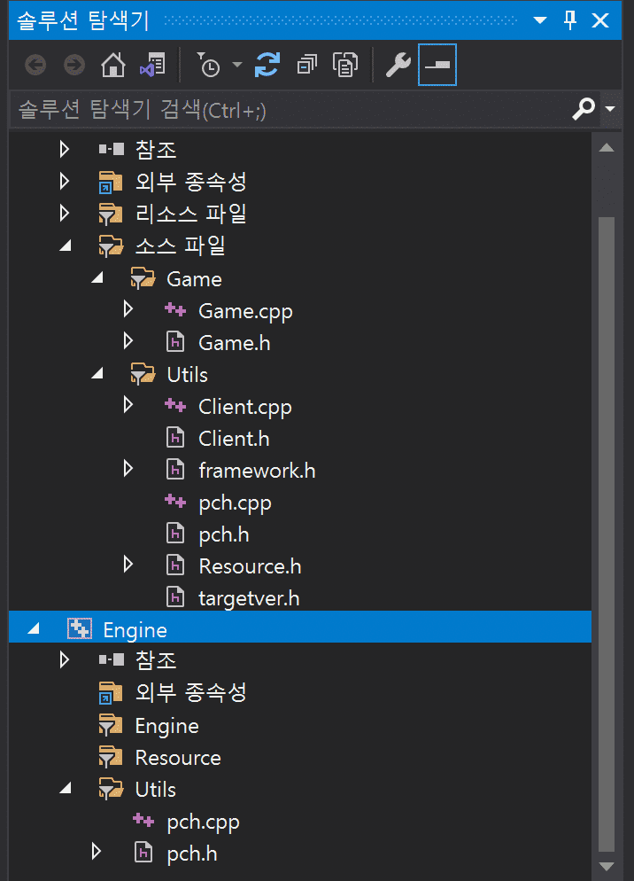 |

7. EnginePch 추가

   > Client의 Pch와 구분하고 자주 활용되는 API를 한 곳에서 관리

   |              EnginePch 클래스 생성              |
   | :---------------------------------------------: |
   |  |

   - (Engine's) pch.h

     > EnginePch.h 를 사용할 것임을 선언해준다.

     ```cpp
     ...

     #ifndef PCH_H
     #define PCH_H

     // 여기에 미리 컴파일하려는 헤더 추가
     //#include "framework.h"

     #define WIN32_LEAN_AND_MEAN             // 거의 사용되지 않는 내용을 Windows 헤더에서 제외합니다.

     #include "EnginePch.h"    // EnginePch.h를 사용하도록 설정

     #endif //PCH_H

     ```

   - EnginePch.h

     > "d3dx12.h" 파일은 따로 다운받아서 추가해준다.

     |   Engine 프로젝트에 `d3dx12.h` 추가   |
     | :-----------------------------------: |
     | 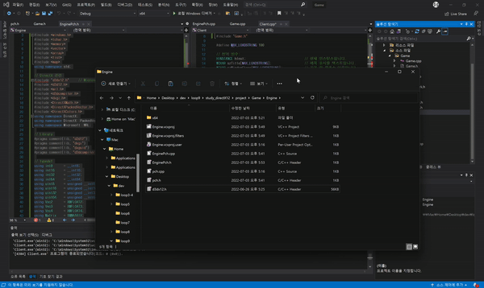 |

     ```cpp
     #pragma once

     #include <windows.h>
     #include <tchar.h>
     #include <memory>
     #include <string>
     #include <vector>
     #include <array>
     #include <list>
     #include <map>
     using namespace std;

     // DirectX 관련
     #include "d3dx12.h"   // Microsoft의 비공식 라이브러리
     #include <d3d12.h>
     #include <wrl.h>
     #include <d3dcompiler.h>
     #include <dxgi.h>
     #include <DirectXMath.h>
     #include <DirectXPackedVector.h>
     #include <DirectXColors.h>
     using namespace DirectX;
     using namespace DirectX::PackedVector;
     using namespace Microsoft::WRL;

     // Library
     #pragma comment(lib, "d3d12")
     #pragma comment(lib, "dxgi")
     #pragma comment(lib, "dxguid")
     #pragma comment(lib, "d3dcompiler")

     // typedef
     using int8     = __int8;
     using int16    = __int16;
     using int32    = __int32;
     using int64    = __int64;
     using uint8    = unsigned __int8;
     using uint16   = unsigned __int16;
     using uint32   = unsigned __int32;
     using uint64   = unsigned __int64;
     using Vec2     = XMFLOAT2;
     using Vec3     = XMFLOAT3;
     using Vec4     = XMFLOAT4;
     using Matrix   = XMMATRIX;
     ```

8. Client에 Engine의 헤더와 라이브러리 경로 제공

   1. 폴더 정리

      |                    Game 폴더 정리                     |
      | :---------------------------------------------------: |
      | 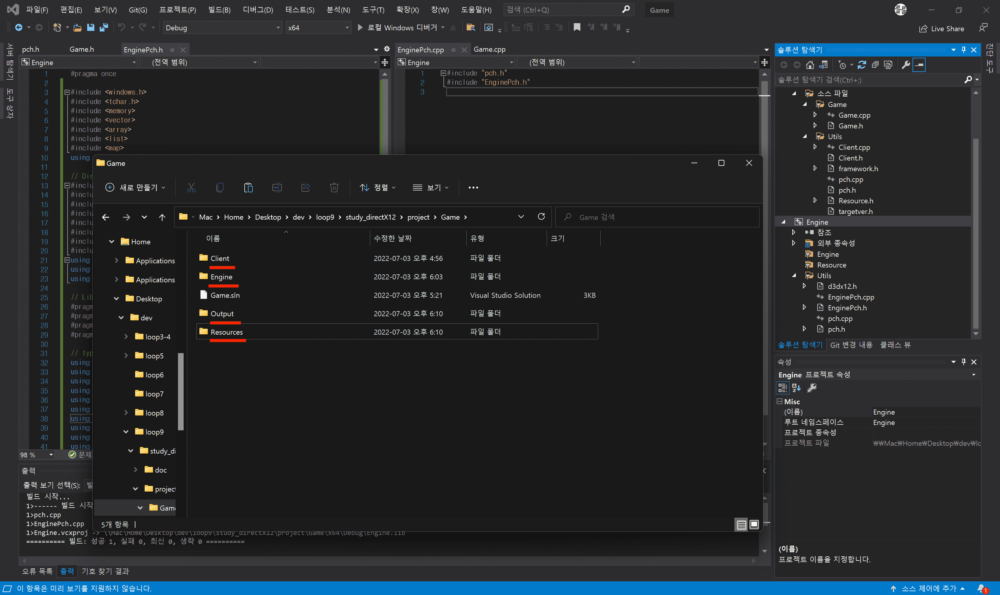 |

      - Game
        - Client
          > Client Scripts
        - Engine
          > Engine Scripts
        - Output
          > 빌드 결과물: `*.exe`, `*.lib`
        - Resources
          > 각종 리소스 파일

   2. Engine 출력 디렉터리 설정

      > Client도 마찬가지로 출력 디렉터리를 "$(SolutionDir)Output\"으로 해준다.

      |        Engine의 출력 디렉터리를 `Output/`으로 설정        |
      | :-------------------------------------------------------: |
      | 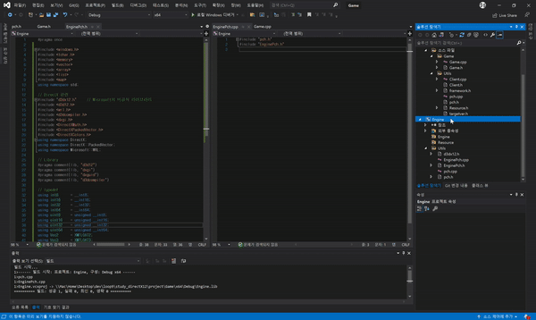 |

   3. Client에 Engine의 `.h`, `.lib` 경로 제공

      > Client에서 Engine의 `.h`와 Output의 `.lib`를 사용
      >
      > Client 속성 창에서 수정

      |          `포함 디렉터리`: 헤더 위치           |     `라이브러리 디렉터리`: 라이브러리 위치      |
      | :-------------------------------------------: | :---------------------------------------------: |
      | 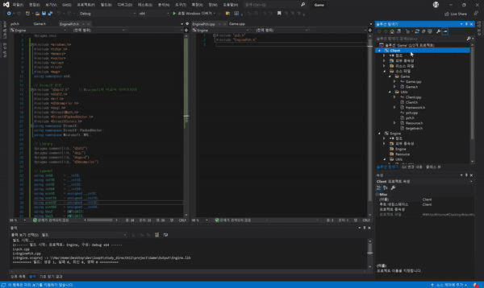 | 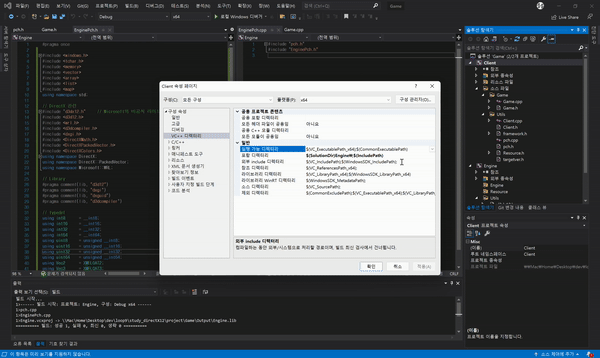 |

      - (Client's) pch.h

        ```cpp
        #pragma once

        // 링커가 작업 디렉터리에서 찾아본 이후에 lib 환경 변수의 디렉터리에서 찾도록 설정
        // 다른 방법은 Client 속성 창 - 링커 - 입력 - 추가 종속성 에서 "Engine.lib"를 추가해준다.
        #pragma comment(lib, "Engine.lib")

        #include "EnginePch.h"    // EnginePch 사용
        ```

---

## 장치 초기화

- 장치 초기화란?

  > GPU에게 일감을 넘기기 위한 사전 작업

- 각 기능 별로 클래스 생성

  - Engine

    - Device
      > 일종의 인력 사무소.
      >
      > GPU와 가장 밀접하며, 그래픽 디바이스(COM 객체) 생성
    - CommandQueue
      > CPU가 일감들을 기록했다가 GPU에게 한 방에 요청
    - SwapChain
      > 순차적으로 연결된 프레임 버퍼들의 집합
    - DescriptorHeap
      > 각종 리소스를 어떤 용도로 사용하는지 꼼꼼하게 적어서 넘겨주는 용도

  |                         클래스 생성 결과                          |
  | :---------------------------------------------------------------: |
  | 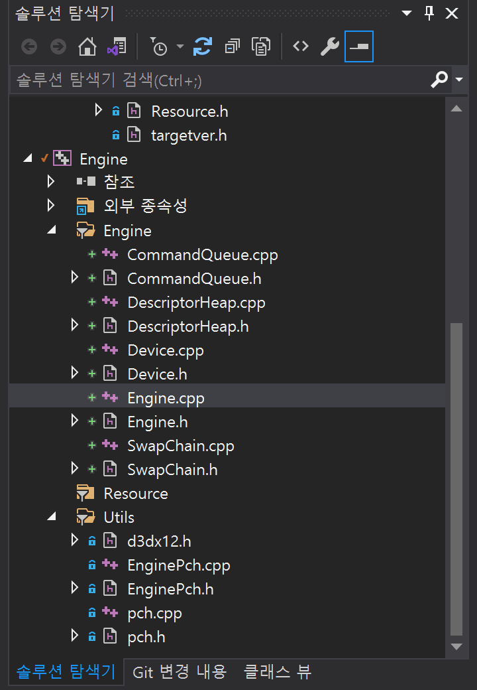 |

### Engine

- EnginePch.h

  > 메인 프로젝트에서 넘겨받을 데이터를 선언해준다.

  ```cpp

  ...

  struct WindowInfo
  {
      HWND    hwnd;     // 출력 윈도우
      int32   width;    // 너비
      int32   height;   // 높이
      bool    windowed; // 창모드 or 전체화면
  };

  ...

  ```

- EnginePch.cpp

  > Client에서 사용할 전역 엔진 스마트 포인터 변수

  ```cpp
  #include "pch.h"
  #include "EnginePch.h"

  #include "Engine.h"

  unique_ptr<Engine> GEngine = make_unique<Engine>();
  ```

- Engine.h

  ```cpp
  #pragma once

  class Engine
  {
  public:
      void Init(const WindowInfo& window);
      void ResizeWindow(int32 width, int32 height);

      void Render();    // 렌더링

  private:
      // 그려질 화면 크기 관련
      WindowInfo      _window;
      D3D12_VIEWPORT  _viewport = {};
      D3D12_RECT      _scissorRect = {};

      shared_ptr<class Device> _device;
      shared_ptr<class CommandQueue> _cmdQueue;
      shared_ptr<class SwapChain> _swapChain;
      shared_ptr<class DescriptorHeap> _descHeap;
  };

  ```

- Engine.cpp

  ```cpp
  #include "pch.h"
  #include "Engine.h"

  #include "Device.h"
  #include "CommandQueue.h"
  #include "SwapChain.h"
  #include "DescriptorHeap.h"

  void Engine::Init(const WindowInfo& window)
  {
      _window = window;
      ResizeWindow(window.width, window.height);

      // 그려질 화면 크기 설정
      _viewport = { 0, 0, static_cast<FLOAT>(window.width), static_cast<FLOAT>(window.height), 0.0f, 1.0f };
      _scissorRect = CD3DX12_RECT(0, 0, window.width, window.height);

      _device = make_shared<Device>();
      _cmdQueue = make_shared<CommandQueue>();
      _swapChain = make_shared<SwapChain>();
      _descHeap = make_shared<DescriptorHeap>();
  }

  void Engine::ResizeWindow(int32 width, int32 height)
  {
      _window.width = width;
      _window.height = height;

      RECT rect = { 0, 0, width, height };
      ::AdjustWindowRect(&rect, WS_OVERLAPPEDWINDOW, false);        // 윈도우 크기 조절
      ::SetWindowPos(_window.hwnd, 0, 100, 100, width, height, 0);  // 윈도우 위치 설정
  }

  void Engine::Render()
  {

  }

  ```

### Device

- `Device`

  > 각종 디바이스 COM(Component Object Model) 객체 모음이다.

  - `COM`(Component Object Model)

    > DX의 프로그래밍 언어 독립성과 하위 호환성을 가능하게 하는 기술이다.

  - `DXGI`('D'irect'X' 'G'raphics 'I'nfrastructure)

    > DirectX 라이브러리를 사용하기 위한 기반이 되는 라이브러리.

    |         DXGI          |
    | :-------------------: |
    | 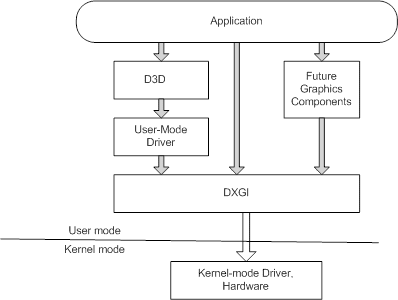 |

- Device.h

  ```cpp
  class Device
  {
  public:
      void Init();

      ComPtr<IDXGIFactory> GetDXGI() { return _dxgi; }
      ComPtr<ID3D12Device> GetDevice() { return _device; }

  private:
      ComPtr<ID3D12Debug>   _debugController;
      ComPtr<IDXGIFactory>  _dxgi;      // 화면 관련 기능들
      ComPtr<ID3D12Device>  _device;    // 각종 객체 생성
  };
  ```

- Device.cpp

  ```cpp
  #include "pch.h"
  #include "Device.h"

  void Device::Init()
  {
      // D3D12 디버그층 활성화
      // - VC++ 출력 창에 상세한 디버깅 메시지 출력
      // - riid: 디바이스의 COM ID
      // - ppDevice: 생성된 장치가 매개변수에 설정
  #ifdef _DEBUG
      ::D3D12GetDebugInterface(IID_PPV_ARGS(&_debugController));
      _debugController->EnableDebugLayer();
  #endif

      // DXGI(DirectX Graphics Infrastructure)
      // Direct3D와 함께 쓰이는 API
      // - 전체 화면 모드 전환
      // - 지원되는 디스플레이 모드 열거 등
      // CreateDXGIFactory
      // - riid: 디바이스의 COM ID
      // - ppDevice: 생성된 장치가 매개변수에 설정
      ::CreateDXGIFactory(IID_PPV_ARGS(&_dxgi));

      // CreateDevice
      // - 디스플레이 어뎁터(그래픽 카드)를 나타내는 객체
      // - pAdapter: nullptr 저장하면 시스템 기본 디스플레이 어댑터
      // - MinimumFeatureLevel: 응용 프로그램이 요구하는 최소 기능 수준(구닥다리 걸러낸다)
      // - riid: 디바이스의 COM ID
      // - ppDevice: 생성된 장치가 매개변수에 설정
      ::D3D12CreateDevice(nullptr, D3D_FEATURE_LEVEL_11_0, IID_PPV_ARGS(&_device));
  }
  ```

- Engine.cpp

  > 초기화해주기

  ```cpp

  ...

  void Engine::Init(const WindowInfo& window)
  {
      ...

      _device->Init();
  }

  ...

  ```

### Command Queue

- `Command Queue`

  > DirectX 12에 등장한 개념.
  >
  > GPU에게 일감을 요청할 때, 하나씩 요청하면 비효율적이므로 리스트에 일감을 쌓아 한 번에 요청할 때 쓰인다.

- CommandQueue.h

  ```cpp
  #pragma once

  class SwapChain;
  class DescriptorHeap;

  class CommandQueue
  {
  public:
      ~CommandQueue();

      void Init(ComPtr<ID3D12Device> device, shared_ptr<SwapChain> swapChain, shared_ptr<DescriptorHeap> descHeap);

      void WaitSync();    // Fence를 이용해 동기화를 위한 함수

      ComPtr<ID3D12CommandQueue> GetCmdQueue() const { return _cmdQueue; }

  private:
      ComPtr<ID3D12CommandQueue>        _cmdQueue;
      ComPtr<ID3D12CommandAllocator>    _cmdAlloc;    // 메모리 공간
      ComPtr<ID3D12GraphicsCommandList> _cmdList;     // 일감 목록

      // Fence: 울타리
      // CPU / GPU 동기화를 위한 간단한 도구
      ComPtr<ID3D12Fence>   _fence;
      uint32                _fenceValue = 0;
      HANDLE                _fenceEvent = INVALID_HANDLE_VALUE;

      shared_ptr<SwapChain>       _swapChain;
      shared_ptr<DescriptorHeap>  _descHeap;

  };

  ```

- CommandQueue.cpp

  ```cpp
  #include "pch.h"
  #include "CommandQueue.h"

  CommandQueue::~CommandQueue()
  {
      // Event 해제
      ::CloseHandle(_fenceEvent);
  }

  void CommandQueue::Init(ComPtr<ID3D12Device> device, shared_ptr<SwapChain> swapChain, shared_ptr<DescriptorHeap> descHeap)
  {
      _swapChain = swapChain;
      _descHeap = descHeap;

      D3D12_COMMAND_QUEUE_DESC queueDesc = {};
      queueDesc.Type = D3D12_COMMAND_LIST_TYPE_DIRECT;
      queueDesc.Flags = D3D12_COMMAND_QUEUE_FLAG_NONE;

      device->CreateCommandQueue(&queueDesc, IID_PPV_ARGS(&_cmdQueue));

      // D3D12_COMMAND_LIST_TYPE_DIRECT: GPU가 직접 실행하는 명령 목록
      device->CreateCommandAllocator(D3D12_COMMAND_LIST_TYPE_DIRECT, IID_PPV_ARGS(&_cmdAlloc));

      // GPU가 하나인 시스템에서는 0으로
      // DIRECT or BUNDLE
      // Allocator
      // 초기 상태(그리기 명령은 nullptr 지정)
      device->CreateCommandList(0, D3D12_COMMAND_LIST_TYPE_DIRECT, _cmdAlloc.Get(), nullptr, IID_PPV_ARGS(&_cmdList));

      // CommandList는 Open / Close 상태가 있고,
      // Open 상태에서 Command를 넣다가 Close한 다음 제출하는 개념
      _cmdList->Close();

      // CreateFence
      // - CPU와 GPU의 동기화 수단으로 쓰인다
      device->CreateFence(0, D3D12_FENCE_FLAG_NONE, IID_PPV_ARGS(&_fence));
      _fenceEvent = ::CreateEvent(nullptr, FALSE, FALSE, nullptr);
  }

  void CommandQueue::WaitSync()
  {
      // 일감 상태 번호를 표시
      _fenceValue++;

      // Command Queue에도 펜스 번호를 알려준다.
      // GPU가 "Signal()" 이전 명령들을 처리 완료 전까지 새 울타리가 설정되지 않는다.
      _cmdQueue->Signal(_fence.Get(), _fenceValue);

      // GPU가 해당 펜스 지점까지 명령을 완료할 때까지 CPU는 기다린다.
      if (_fence->GetCompletedValue() < _fenceValue)
      {
          // GPU가 현재 펜스에 도달하면 Event가 발생한다.
          _fence->SetEventOnCompletion(_fenceValue, _fenceEvent);

          // GPU가 현재 펜스에서 발생할 Event에 도달할 때까지 CPU는 기다린다.
          ::WaitForSingleObject(_fenceEvent, INFINITE); // CPU 계속 기다림.
      }
  }

  ```

- Engine.cpp

  > 초기화해주기

  ```cpp

  ...

  void Engine::Init(const WindowInfo& window)
  {
      ...

      _device->Init();
      _cmdQueue->Init(_device->GetDevice(), _swapChain, _descHeap);
  }

  ...

  ```

### Swap Chain

- GPU에게 일감을 넘기는 과정

  1. 현재 게임 월드 상황을 묘사한다.
  2. 어떤 공식으로, 어떻게 계산할지 GPU에게 건네준다.
  3. GPU가 열심히 계산한다.
  4. CPU가 결과물을 받아서 화면에 그려준다.
     > (1) 어떤 종이(Buffer)에 그려달라고 부탁한다.
     >
     > (2) 특수 종이를 만들고 GPU에게 건네주고 결과물을 해당 종이에 받는다.
     >
     > (3) 화면에 특수 종이(GPU의 결과물)을 출력한다.

- `Swap Chain`

  > 화면에 현재 결과를 출력하는 와중에, 다음 화면도 GPU에게 부탁해야 한다.
  >
  > 특수 종이를 2개 만들어 "CPU 출력용", "GPU 계산용(Back Buffer)"을 구별해서 사용한다. (= `Dubble Buffering`)
  >
  > 이 때, 계속 번갈아서 "CPU 출력용"과 "GPU 계산용"을 바꿔주는 작업을 `Swap Chain`이라 한다.

- EnginePch.h

  > 버퍼 수를 enum 상수로 선언해 공용으로 사용한다.

  ```cpp
  enum
  {
      SWAP_CHAIN_BUFFER_COUNT = 2,
  };
  ```

- SwapChain.h

  ```cpp
  #pragma once


  class SwapChain
  {
  public:
      void Init(const WindowInfo& info, ComPtr<IDXGIFactory> dxgi, ComPtr<ID3D12CommandQueue> cmdQueue);

      void Present();
      void SwapIndex();

      ComPtr<IDXGISwapChain> GetSwapChain() const { return _swapChain; }
      ComPtr<ID3D12Resource> GetRenderTarget(int32 index) const { return _renderTargets[index]; }

      uint32 GetCurrentBackBufferIndex() const { return _backBufferIndex; }
      ComPtr<ID3D12Resource> GetCurrentBackBufferResource() const { return _renderTargets[_backBufferIndex]; }

    private:
      ComPtr<IDXGISwapChain>  _swapChain;
      ComPtr<ID3D12Resource>  _renderTargets[SWAP_CHAIN_BUFFER_COUNT];  // EnginePch에 매크로 선언

      uint32 _backBufferIndex = 0;  // 0 or 1

  };

  ```

- SwapChain.cpp

  ```cpp
  #include "pch.h"
  #include "SwapChain.h"

  void SwapChain::Init(const WindowInfo& info, ComPtr<IDXGIFactory> dxgi, ComPtr<ID3D12CommandQueue> cmdQueue)
  {
      // 이전 내용은 Clear
      _swapChain.Reset();

      DXGI_SWAP_CHAIN_DESC sd;
      sd.BufferDesc.Width = static_cast<uint32>(info.width);    // 버퍼의 해상도 너비
      sd.BufferDesc.Height = static_cast<uint32>(info.height);  // 버퍼의 해상도 높이
      sd.BufferDesc.RefreshRate.Numerator = 60;                 // 화면 갱신 비율 분자 값
      sd.BufferDesc.RefreshRate.Denominator = 1;                // 화면 갱신 비율 분모 값
      sd.BufferDesc.Format = DXGI_FORMAT_R8G8B8A8_UNORM;        // 버퍼의 디스플레이 방식
      sd.BufferDesc.ScanlineOrdering = DXGI_MODE_SCANLINE_ORDER_UNSPECIFIED;
      sd.BufferDesc.Scaling = DXGI_MODE_SCALING_UNSPECIFIED;
      sd.SampleDesc.Count = 1;                                  // 멀티 샘플링 OFF
      sd.SampleDesc.Quality = 0;
      sd.BufferUsage = DXGI_USAGE_RENDER_TARGET_OUTPUT;         // 후면 버퍼에 렌더링 출력
      sd.BufferCount = SWAP_CHAIN_BUFFER_COUNT;                 // 전면, 후면 버퍼(2개)
      sd.OutputWindow = info.hwnd;
      sd.Windowed = info.windowed;
      sd.SwapEffect = DXGI_SWAP_EFFECT_FLIP_DISCARD;            // 전면, 후면 버퍼 교체 시 이전 프레임 정보 버림
      sd.Flags = DXGI_SWAP_CHAIN_FLAG_ALLOW_MODE_SWITCH;

      // 출력과 관련되어서 Device가 아닌 DXGI에서 생성해준다.
      // 동시에 버퍼도 생성.
      dxgi->CreateSwapChain(cmdQueue.Get(), &sd, &_swapChain);

      // 앞서 생성한 버퍼를 _renderTargets에 저장
      for (int32 i = 0; i < SWAP_CHAIN_BUFFER_COUNT; i++)
          _swapChain->GetBuffer(i, IID_PPV_ARGS(&_renderTargets[i]));
  }

  void SwapChain::Present()
  {
      // 프레임 제공
      _swapChain->Present(0, 0);
  }

  void SwapChain::SwapIndex()
  {
      _backBufferIndex = (_backBufferIndex + 1) % SWAP_CHAIN_BUFFER_COUNT;
  }

  ```

- Engine.cpp

  > 초기화해주기

  ```cpp

  ...

  void Engine::Init(const WindowInfo& window)
  {
      ...

      _device->Init();
      _cmdQueue->Init(_device->GetDevice(), _swapChain, _descHeap);
      _swapChain->Init(window, _device->GetDXGI(), _cmdQueue->GetCmdQueue());
  }

  ...

  ```

### Descriptor Heap

- `Descriptor Heap`

  > DirectX 12에 등장. 이전(DirectX 11)까지는 "View"로 통용되었다.
  >
  > 일종의 기안서: GPU가 알아들을 수 있도록 각 리소스가 어떤 용도로 사용되는지 적은 내용.
  >
  > GPU에게 일감을 줄 때, 리소스를 바로 넘기지 않고 Wrapping된 클래스(Descriptor Heap)를 넘긴다.

  - 각 리소스

    > 따로 관리하던 것을 `Descriptor Heap`이 관리

    - `RTV`(Render Target View)
    - `DSV`(Depth Stencil View)
    - `CBV`(Constant Buffer View)
    - `SRV`(Shader Resource View)
    - `UAV`(Unordered Access View)

- DescriptorHeap.h

  ```cpp
  #pragma once

  class SwapChain;

  class DescriptorHeap
  {
  public:
      void Init(ComPtr<ID3D12Device> device, shared_ptr<SwapChain> swapChain);

      D3D12_CPU_DESCRIPTOR_HANDLE GetRTV(int32 idx) const { return _rtvHandle[idx]; }
      D3D12_CPU_DESCRIPTOR_HANDLE GetBackBufferView() const;

  private:
      // Render Target View
      ComPtr<ID3D12DescriptorHeap>  _rtvHeap;
      uint32                        _rtvHeapSize;
      D3D12_CPU_DESCRIPTOR_HANDLE   _rtvHandle[SWAP_CHAIN_BUFFER_COUNT];

      shared_ptr<SwapChain>         _swapChain;
  };

  ```

- DescriptorHeap.cpp

  ```cpp
  #include "pch.h"
  #include "DescriptorHeap.h"

  #include "SwapChain.h"

  void DescriptorHeap::Init(ComPtr<ID3D12Device> device, shared_ptr<SwapChain> swapChain)
  {
      _swapChain = swapChain;

      // RTV(Render Target View) 크기 계산
      _rtvHeapSize = device->GetDescriptorHandleIncrementSize(D3D12_DESCRIPTOR_HEAP_TYPE_RTV);

      D3D12_DESCRIPTOR_HEAP_DESC rtvDesc;
      rtvDesc.Type = D3D12_DESCRIPTOR_HEAP_TYPE_RTV;
      rtvDesc.NumDescriptors = SWAP_CHAIN_BUFFER_COUNT;
      rtvDesc.Flags = D3D12_DESCRIPTOR_HEAP_FLAG_NONE;
      rtvDesc.NodeMask = 0;

      // 이 시점에 rtvHeap 배열 생성
      device->CreateDescriptorHeap(&rtvDesc, IID_PPV_ARGS(&_rtvHeap));

      // rtvHeap의 시작 주소 값을 가져오기
      D3D12_CPU_DESCRIPTOR_HANDLE rtvHeapBegin = _rtvHeap->GetCPUDescriptorHandleForHeapStart();

      for (int i = 0; i < SWAP_CHAIN_BUFFER_COUNT; i++)
      {
          // "CD~"(from. d3dx12.h)
          // RTV 배열: [_rtvHeapBegin] [_rtvHeapBegin + (i * _rtvHeapSize)]
          _rtvHandle[i] = CD3DX12_CPU_DESCRIPTOR_HANDLE(rtvHeapBegin, i * _rtvHeapSize);

          // Descriptor Heap으로 rtv(Render Target View) 생성
          device->CreateRenderTargetView(swapChain->GetRenderTarget(i).Get(), nullptr, _rtvHandle[i]);
      }
  }

  D3D12_CPU_DESCRIPTOR_HANDLE DescriptorHeap::GetBackBufferView() const
  {
      return GetRTV(_swapChain->GetCurrentBackBufferIndex());
  }

  ```

- Engine.cpp

  > 초기화해주기

  ```cpp

  ...

  void Engine::Init(const WindowInfo& window)
  {
      ...

      _device->Init();
      _cmdQueue->Init(_device->GetDevice(), _swapChain, _descHeap);
      _swapChain->Init(window, _device->GetDXGI(), _cmdQueue->GetCmdQueue());
      _descHeap->Init(_device->GetDevice(), _swapChain);
  }

  ...

  ```

### Engine's Rendering 코드 작성

- CommandQueue.h

  > RenderBegin(): Engine의 RenderBegin() 시점에서 요청 사항을 넣는 용도
  >
  > RenderEnd(): Engine의 RenderEnd() 시점에서 쌓은 일감을 GPU에게 넘기는 용도

  ```cpp

  ...

  public:
      ...

      void RenderBegin(const D3D12_VIEWPORT* vp, const D3D12_RECT* rect);
      void RenderEnd();

  ...

  ```

- CommandQueue.cpp

  ```cpp

  ...

  #include "SwapChain.h"
  #include "DescriptorHeap.h"

  ...


  void CommandQueue::RenderBegin(const D3D12_VIEWPORT* vp, const D3D12_RECT* rect)
  {
      // 이전 내용 clear
      _cmdAlloc->Reset();
      _cmdList->Reset(_cmdAlloc.Get(), nullptr);

      // Back Buffer Resource를 "화면 출력용"에서 "외주 결과물"로 변경 예약
      D3D12_RESOURCE_BARRIER barrier = CD3DX12_RESOURCE_BARRIER::Transition(
        _swapChain->GetCurrentBackBufferResource().Get(), // Back Buffer Resource
        D3D12_RESOURCE_STATE_PRESENT,         // before. 화면 출력
        D3D12_RESOURCE_STATE_RENDER_TARGET    // after. 외주 결과물
      );

      // 명령 목록에 "변경 예약"을 삽입
      _cmdList->ResourceBarrier(1, &barrier);

      // viewport와 scissor rect를 설정한다.
      // Command List가 리셋될 때마다 설정해야 한다.
      _cmdList->RSSetViewports(1, vp);
      _cmdList->RSSetScissorRects(1, rect);

      // 렌더할 버퍼 구체화.
      // GPU에게 결과물을 계산해달라고 요청 명령 삽입
      D3D12_CPU_DESCRIPTOR_HANDLE backBufferView = _descHeap->GetBackBufferView();
      _cmdList->ClearRenderTargetView(backBufferView, Colors::LightSteelBlue, 0, nullptr);
      _cmdList->OMSetRenderTargets(1, &backBufferView, FALSE, nullptr);
  }

  void CommandQueue::RenderEnd()
  {
      // Back Buffer Resource를 "외주 결과물"에서 "화면 출력용"으로 변경 예약
      D3D12_RESOURCE_BARRIER barrier = CD3DX12_RESOURCE_BARRIER::Transition(
        _swapChain->GetCurrentBackBufferResource().Get(),
        D3D12_RESOURCE_STATE_RENDER_TARGET,   // before. 외주 결과물
        D3D12_RESOURCE_STATE_PRESENT          // after. 화면 출력
      );

      // 명령 목록에 "변경 예약"을 삽입
      _cmdList->ResourceBarrier(1, &barrier);
      _cmdList->Close();

      // Command List 실행
      ID3D12CommandList* cmdListArr[] = { _cmdList.Get() };
      _cmdQueue->ExecuteCommandLists(_countof(cmdListArr), cmdListArr); // 실질적 요청

      // 화면을 채워줌
      _swapChain->Present();

      // GPU가 모든 명령 실행할 때까지 CPU가 대기
      WaitSync();

      _swapChain->SwapIndex();
  }
  ```

- Engine.h

  ```cpp

  ...

  public:
      void RenderBegin();   // Command Queue에 요청 사항 넣기
      void RenderEnd();     // 쌓은 일감을 GPU에게 넘김

  ...

  ```

- Engine.cpp

  ```cpp

  ...

  void Engine::Render()
  {
      RenderBegin();

      // @TODO: 나머지 물체 그리기

      RenderEnd();
  }

  void Engine::RenderBegin()
  {
      _cmdQueue->RenderBegin(&_viewport, &_scissorRect);
  }

  void Engine::RenderEnd()
  {
      _cmdQueue->RenderEnd();
  }
  ```

### Game's Update 코드 작성

- Game.h

  > Window Info 초기화 매개변수 추가

  ```cpp
  #pragma once

  class Game
  {
  public:
      void Init(const WindowInfo& window);
      void Update();
  };
  ```

- Game.cpp

  ```cpp
  #include "pch.h"
  #include "Game.h"

  #include "Engine.h"

  void Game::Init(const WindowInfo& window)
  {
      GEngine->Init(window);
  }

  void Game::Update()
  {
      GEngine->Render();
  }

  ```

- Client.cpp

  ```cpp

  ...

  // 전역 변수:
  WindowInfo GWindowInfo;

  ...


  int APIENTRY wWinMain(_In_ HINSTANCE hInstance,
                      _In_opt_ HINSTANCE hPrevInstance,
                      _In_ LPWSTR    lpCmdLine,
                      _In_ int       nCmdShow)
  {
      ...

      MSG msg;

      GWindowInfo.width = 800;
      GWindowInfo.height = 600;
      GWindowInfo.windowed = true;

      // 게임 생성 후 초기화
      unique_ptr<Game> game = make_unique<Game>();    // Smart-pointer 사용
      game->Init(GWindowInfo);

      ...

  }

  ...

  BOOL InitInstance(HINSTANCE hInstance, int nCmdShow)
  {
      ...

      HWND hWnd = CreateWindowW(szWindowClass, szTitle, WS_OVERLAPPEDWINDOW,
        CW_USEDEFAULT, 0, CW_USEDEFAULT, 0, nullptr, nullptr, hInstance, nullptr);

      ...

      GWindowInfo.hwnd = hWnd;    // WindowInfo에 윈도우 핸들 추가

      return TRUE;
  }

  ...

  ```

- 결과

  |                 장치 초기화 결과                  |
  | :-----------------------------------------------: |
  |  |

---

## 삼각형 띄우기

### Descriptor Heap 삭제: Swap Chain이 관리

- `DescriptorHeap.h`, `DescriptorHeap.cpp` 삭제

- SwapChain.h

  > `Init()` -> `CreateSwapChain()`, `CreateRTV()`로 분리
  >
  > `GetCurrentBackBufferResource()` -> `GetBackRTVBuffer()`
  >
  > `GetBackRTV()` 추가
  >
  > `_renderTargets` ->`_rtvBuffer`

  ```cpp
  ...

  class SwapChain
  {
  public:
      void Init(const WindowInfo& info, ComPtr<ID3D12Device> device, ComPtr<IDXGIFactory> dxgi, ComPtr<ID3D12CommandQueue> cmdQueue);

      ...
      ComPtr<ID3D12Resource> GetRenderTarget(int32 index) const { return _rtvBuffer[index]; }

      ComPtr<ID3D12Resource> GetBackRTVBuffer() const { return _rtvBuffer[_backBufferIndex]; }

      D3D12_CPU_DESCRIPTOR_HANDLE GetBackRTV() const { return _rtvHandle[_backBufferIndex]; }

  private:
      void CreateSwapChain(const WindowInfo& info, ComPtr<IDXGIFactory> dxgi, ComPtr<ID3D12CommandQueue> cmdQueue);
      void CreateRTV(ComPtr<ID3D12Device> device);    // Descriptor Heap의 Init 내용

  private:
      ...

      ComPtr<ID3D12Resource>  _rtvBuffer[SWAP_CHAIN_BUFFER_COUNT];  // EnginePch에 매크로 선언
      uint32                  _backBufferIndex = 0;                 // 0 or 1

      // Render Target View
      ComPtr<ID3D12DescriptorHeap>  _rtvHeap;
      D3D12_CPU_DESCRIPTOR_HANDLE   _rtvHandle[SWAP_CHAIN_BUFFER_COUNT];
  }
  ```

- SwapChain.cpp

  ```cpp
  ...

  void SwapChain::Init(const WindowInfo& info, ComPtr<ID3D12Device> device, ComPtr<IDXGIFactory> dxgi, ComPtr<ID3D12CommandQueue> cmdQueue)
  {
      CreateSwapChain(info, dxgi, cmdQueue);
      CreateRTV(device);
  }

  ...

  void SwapChain::CreateSwapChain(const WindowInfo& info, ComPtr<IDXGIFactory> dxgi, ComPtr<ID3D12CommandQueue> cmdQueue)
  {
      // 이전 내용은 Clear
      _swapChain.Reset();

      DXGI_SWAP_CHAIN_DESC sd;
      sd.BufferDesc.Width = static_cast<uint32>(info.width);    // 버퍼의 해상도 너비
      sd.BufferDesc.Height = static_cast<uint32>(info.height);  // 버퍼의 해상도 높이
      @@ -29,16 +46,33 @@ void SwapChain::Init(const WindowInfo& info, ComPtr<IDXGIFactory> dxgi, ComPtr<I

      // 앞서 생성한 버퍼를 _renderTargets에 저장
      for (int32 i = 0; i < SWAP_CHAIN_BUFFER_COUNT; i++)
          _swapChain->GetBuffer(i, IID_PPV_ARGS(&_rtvBuffer[i]));
  }

  void SwapChain::CreateRTV(ComPtr<ID3D12Device> device)
  {
      // RTV(Render Target View) 크기 계산
      int32 rtvHeapSize = device->GetDescriptorHandleIncrementSize(D3D12_DESCRIPTOR_HEAP_TYPE_RTV);

      D3D12_DESCRIPTOR_HEAP_DESC rtvDesc;
      rtvDesc.Type = D3D12_DESCRIPTOR_HEAP_TYPE_RTV;
      rtvDesc.NumDescriptors = SWAP_CHAIN_BUFFER_COUNT;
      rtvDesc.Flags = D3D12_DESCRIPTOR_HEAP_FLAG_NONE;
      rtvDesc.NodeMask = 0;

      // 이 시점에 rtvHeap 배열 생성
      device->CreateDescriptorHeap(&rtvDesc, IID_PPV_ARGS(&_rtvHeap));

      // rtvHeap의 시작 주소 값을 가져오기
      D3D12_CPU_DESCRIPTOR_HANDLE rtvHeapBegin = _rtvHeap->GetCPUDescriptorHandleForHeapStart();

      for (int i = 0; i < SWAP_CHAIN_BUFFER_COUNT; i++)
      {
          // "CD~"(from. d3dx12.h)
          // RTV 배열: [_rtvHeapBegin] [_rtvHeapBegin + (i * _rtvHeapSize)]
          _rtvHandle[i] = CD3DX12_CPU_DESCRIPTOR_HANDLE(rtvHeapBegin, i * rtvHeapSize);

          // Descriptor Heap으로 rtv(Render Target View) 생성
          device->CreateRenderTargetView(_rtvBuffer[i].Get(), nullptr, _rtvHandle[i]);
      }
  }

  ```

- Engine.h

  > `shared_ptr<class DescriptorHeap> _descHeap;` 삭제

- Engine.cpp

  > `#include DescriptorHeap.h` 삭제
  >
  > DescriptorHeap의 Init 지우고, SwapChain에 Device 넘겨주기

  ```cpp
  void Engine::Init(const WindowInfo& window)
  {
      _cmdQueue->Init(_device->GetDevice(), _swapChain);    // Descriptor Heap 넘기는 건 취소
      _swapChain->Init(window, _device->GetDevice(), _device->GetDXGI(), _cmdQueue->GetCmdQueue()); // Device 넘겨주기
  }
  ```

- CommandQueue.h

  > Init() 경우 Descriptor Heap 넘겨받지 않기
  >
  > Descriptor Heap 캐싱 취소
  >
  > `GetCurrentBackBufferResource()` -> `GetBackRTVBuffer()`
  >
  > `GetBackRTV()` 추가

  ```cpp
  public:
      void Init(ComPtr<ID3D12Device> device, shared_ptr<SwapChain> swapChain);
  ```

- CommandQueue.cpp

  > `#include "DescriptorHeap.h" 삭제

  ```cpp
  void CommandQueue::RenderBegin(const D3D12_VIEWPORT* vp, const D3D12_RECT* rect)
  {
      ...

      // Back Buffer Resource를 "화면 출력용"에서 "외주 결과물"로 변경 예약
      D3D12_RESOURCE_BARRIER barrier = CD3DX12_RESOURCE_BARRIER::Transition(
          _swapChain->GetBackRTVBuffer().Get(), // Back Buffer Resource
          D3D12_RESOURCE_STATE_PRESENT,         // before. 화면 출력
          D3D12_RESOURCE_STATE_RENDER_TARGET    // after. 외주 결과물
      );

      ...

      // 렌더할 버퍼 구체화.
      // GPU에게 결과물을 계산해달라고 요청 명령 삽입
      D3D12_CPU_DESCRIPTOR_HANDLE backBufferView = _swapChain->GetBackRTV();
      ...

      // Back Buffer Resource를 "외주 결과물"에서 "화면 출력용"으로 변경 예약
      D3D12_RESOURCE_BARRIER barrier = CD3DX12_RESOURCE_BARRIER::Transition(
          _swapChain->GetBackRTVBuffer().Get(),
          D3D12_RESOURCE_STATE_RENDER_TARGET,   // before. 외주 결과물
          D3D12_RESOURCE_STATE_PRESENT          // after. 화면 출력
      );
  }
  ```

### RootSignature

- 계약서, 결재 단계
- GPU로 데이터를 전달할 때 어떤 레지스터, 버퍼를 활용하라고 명시

- RootSignature.h

  ```cpp
  #pragma once

  class RootSignature
  {
  public:
      void Init(ComPtr<ID3D12Device> device);

      ComPtr<ID3D12RootSignature> GetSignature() const { return _signature; }

  private:
      ComPtr<ID3D12RootSignature> _signature;
  };

  ```

- RootSignature.cpp

  ```cpp
  #include "pch.h"
  #include "RootSignature.h"

  void RootSignature::Init(ComPtr<ID3D12Device> device)
  {
      D3D12_ROOT_SIGNATURE_DESC sigDesc = CD3DX12_ROOT_SIGNATURE_DESC(D3D12_DEFAULT);
      sigDesc.Flags = D3D12_ROOT_SIGNATURE_FLAG_ALLOW_INPUT_ASSEMBLER_INPUT_LAYOUT;   // 입력 조립기 단계

      ComPtr<ID3DBlob> blobSignature;
      ComPtr<ID3DBlob> blobError;
      ::D3D12SerializeRootSignature(&sigDesc, D3D_ROOT_SIGNATURE_VERSION_1, &blobSignature, &blobError);
      device->CreateRootSignature(0, blobSignature->GetBufferPointer(), blobSignature->GetBufferSize(), IID_PPV_ARGS(&_signature));
  }

  ```

- Engine.h

  ```cpp
  ...

  #include "RootSignature.h"

  ...

  public:
      ...

      shared_ptr<class RootSignature> GetRootSignature() const { return _rootSignature; }

  ...

  private:
      ...

      shared_ptr<RootSignature> _rootSignature;

  ```

- Engine.cpp

  ```cpp
  void Engine::Init(const WindowInfo& window)
  {
      ...

      _rootSignature = make_shared<RootSignature>();

      ...
      _rootSignature->Init(_device->GetDevice());
  }
  ```

### 전역 매크로 추가

- 자주 사용하는 경우에 매크로 변수로 추가한다.

  > ex. Device, Command List, Root Signature

- CommandQueue.h

  > Get Command List 추가

  ```cpp

  public:
      ComPtr< ID3D12GraphicsCommandList> GetCmdList() const{ return _cmdList; }

  ```

- Engine.h

  ```cpp
  #pragma once

  class Device;
  class CommandQueue;
  class SwapChain;
  class RootSignature;

  class Engine
  {
      ...

  public:
      shared_ptr<Device> GetDevice() const { return _device; }
      shared_ptr<CommandQueue> GetCmdQueue() const { return _cmdQueue; }
      shared_ptr<SwapChain> GetSwapChain() const { return _swapChain; }
      shared_ptr<RootSignature> GetRootSignature() const {return _rootSignature;}

      ...
  }
  ```

- EnginePch.h

```cpp
...

#define DEVICE          GEngine->GetDevice()->GetDevice()
#define CMD_LIST        GEngine->GetCmdQueue()->GetCmdList()
#define ROOT_SIGNATURE  GEngine->GetRootSignature()->GetSignature()

...
```

### Mesh

- 정점으로 이루어진 물체

- EnginePch.h

  > Vertex 구조체 추가

  ```cpp
  ...

  struct Vertex
  {
      Vec3 pos;   // x, y, z
      Vec4 color; // R, G, B, A
  };
  ```

- Mesh.h

  ```cpp
  #pragma once

  class Device;
  class CommandQueue;

  class Mesh
  {
  public:
      void Init(vector<Vertex>& vec);
      void Render();

  private:
      ComPtr<ID3D12Resource>    _vertexBuffer;
      D3D12_VERTEX_BUFFER_VIEW  _vertexBufferView = {};
      uint32 _vertexCount = 0;
  };

  ```

- Mesh.cpp

  ```cpp
  #include "pch.h"
  #include "Mesh.h"

  #include "Engine.h"
  #include "Device.h"
  #include "CommandQueue.h"

  void Mesh::Init(vector<Vertex>& vec)
  {
      _vertexCount = static_cast<uint32>(vec.size());   // for. Render
      uint32 bufferSize = _vertexCount * sizeof(Vertex);

      D3D12_HEAP_PROPERTIES heapProperty = CD3DX12_HEAP_PROPERTIES(D3D12_HEAP_TYPE_UPLOAD);
      D3D12_RESOURCE_DESC desc = CD3DX12_RESOURCE_DESC::Buffer(bufferSize);

      DEVICE->CreateCommittedResource(
          &heapProperty,
          D3D12_HEAP_FLAG_NONE,
          &desc,
          D3D12_RESOURCE_STATE_GENERIC_READ,
          nullptr,
          IID_PPV_ARGS(&_vertexBuffer)
      );

      // 삼각형 정보를 Vertex Buffer(in. GPU)로 복사
      void* vertexDataBuffer = nullptr;
      CD3DX12_RANGE readRange(0, 0);
      _vertexBuffer->Map(0, &readRange, &vertexDataBuffer);
      ::memcpy(vertexDataBuffer, &vec[0], bufferSize);
      _vertexBuffer->Unmap(0, nullptr);

      // Vertex Buffer View 초기화
      _vertexBufferView.BufferLocation = _vertexBuffer->GetGPUVirtualAddress();
      _vertexBufferView.StrideInBytes = sizeof(Vertex);   // 정점 1개 크기
      _vertexBufferView.SizeInBytes = bufferSize;         // 버퍼의 크기
  }

  void Mesh::Render()
  {
      CMD_LIST->IASetPrimitiveTopology(D3D_PRIMITIVE_TOPOLOGY_TRIANGLELIST);
      CMD_LIST->IASetVertexBuffers(0, 1, &_vertexBufferView);   // Slot: (0~15)
      CMD_LIST->DrawInstanced(_vertexCount, 1, 0, 0);
  }

  ```

### Shader

- 단계별로 일감을 기술

  - Vertex Shader 단계
    > 정점 정보 설정
  - Pixel Shader 단계
    > 색상을 설정

- Shader.h

  ```cpp
  #pragma once

  class Device;
  class RootSignature;

  class Shader
  {
  public:
      void Init(const wstring& path);
      void Update();

  private:
      void CreateShader(const wstring& path, const string& name, const string& version, ComPtr<ID3DBlob>& blob, D3D12_SHADER_BYTECODE& shaderByteCode);
      void CreateVertexShader(const wstring& path, const string& name, const string& version);
      void CreatePixelShader(const wstring& path, const string& name, const string& version);

  private:
      ComPtr<ID3DBlob>  _vsBlob;
      ComPtr<ID3DBlob>  _psBlob;
      ComPtr<ID3DBlob>  _errBlob;

      ComPtr<ID3D12PipelineState>         _pipelineState;
      D3D12_GRAPHICS_PIPELINE_STATE_DESC  _pipelineDesc = {};
  };

  ```

- Shader.cpp

  ```cpp
  #include "pch.h"
  #include "Shader.h"

  #include "Engine.h"
  #include "RootSignature.h"
  #include "Device.h"
  #include "CommandQueue.h"

  void Shader::Init(const wstring& path)
  {
      CreateVertexShader(path, "VS_Main", "vs_5_0");  // Vertex Shader
      CreatePixelShader(path, "PS_Main", "ps_5_0");   // Pixel Shader

      D3D12_INPUT_ELEMENT_DESC desc[] =
      {
          {"POSITION", 0, DXGI_FORMAT_R32G32B32_FLOAT, 0, 0, D3D12_INPUT_CLASSIFICATION_PER_VERTEX_DATA, 0},
          {"COLOR", 0, DXGI_FORMAT_R32G32B32A32_FLOAT, 0, 12, D3D12_INPUT_CLASSIFICATION_PER_VERTEX_DATA, 0},
      };

      _pipelineDesc.InputLayout = { desc, _countof(desc) };
      _pipelineDesc.pRootSignature = ROOT_SIGNATURE.Get();

      _pipelineDesc.RasterizerState = CD3DX12_RASTERIZER_DESC(D3D12_DEFAULT);
      _pipelineDesc.BlendState = CD3DX12_BLEND_DESC(D3D12_DEFAULT);
      _pipelineDesc.DepthStencilState.DepthEnable = FALSE;
      _pipelineDesc.DepthStencilState.StencilEnable = FALSE;
      _pipelineDesc.SampleMask = UINT_MAX;
      _pipelineDesc.PrimitiveTopologyType = D3D12_PRIMITIVE_TOPOLOGY_TYPE_TRIANGLE;
      _pipelineDesc.NumRenderTargets = 1;
      _pipelineDesc.RTVFormats[0] = DXGI_FORMAT_R8G8B8A8_UNORM;
      _pipelineDesc.SampleDesc.Count = 1;

      DEVICE->CreateGraphicsPipelineState(&_pipelineDesc, IID_PPV_ARGS(&_pipelineState));
  }

  void Shader::Update()
  {
      CMD_LIST->SetPipelineState(_pipelineState.Get());
  }

  void Shader::CreateShader(const wstring& path, const string& name, const string& version, ComPtr<ID3DBlob>& blob, D3D12_SHADER_BYTECODE& shaderByteCode)
  {
      uint32 compileFlag = 0;
  #ifdef _DEBUG
      compileFlag = D3DCOMPILE_DEBUG | D3DCOMPILE_SKIP_OPTIMIZATION;
  #endif

      if (FAILED(::D3DCompileFromFile(path.c_str(), nullptr, D3D_COMPILE_STANDARD_FILE_INCLUDE, name.c_str(), version.c_str(), compileFlag, 0, &blob, &_errBlob)))
      {
          ::MessageBoxA(nullptr, "Shader Create Failed!", nullptr, MB_OK);
      }

      shaderByteCode = { blob->GetBufferPointer(), blob->GetBufferSize() };
  }

  void Shader::CreateVertexShader(const wstring& path, const string& name, const string& version)
  {
      CreateShader(path, name, version, _vsBlob, _pipelineDesc.VS);
  }

  void Shader::CreatePixelShader(const wstring& path, const string& name, const string& version)
  {
      CreateShader(path, name, version, _psBlob, _pipelineDesc.PS);
  }

  ```

- default.hlsli

  ```hlsli
  struct VS_IN
  {
      float3 pos : POSITION;
      float4 color : COLOR;
  };

  struct VS_OUT
  {
      float4 pos : SV_Position;
      float4 color : COLOR;
  };

  // Vertex Shader에 사용될 함수
  VS_OUT VS_Main(VS_IN input)
  {
      VS_OUT output = (VS_OUT)0;

      output.pos = float4(input.pos, 1.f);
      output.color = input.color;

      return output;
  }

  // Pixel Shader에 사용될 함수
  float4 PS_Main(VS_OUT input) : SV_Target
  {
      return input.color;
  }
  ```

### Mesh와 Shader로 삼각형 띄우기

- Game.cpp

  ```cpp
  #include "pch.h"
  #include "Game.h"

  #include "Engine.h"
  #include "Device.h"
  #include "CommandQueue.h"
  #include "RootSignature.h"

  #include "Mesh.h"
  #include "Shader.h"

  shared_ptr<Mesh> mesh = make_shared<Mesh>();
  shared_ptr<Shader> shader = make_shared<Shader>();

  void Game::Init(const WindowInfo& window)
  {
      GEngine->Init(window);

      vector<Vertex> vec(3);
      vec[0].pos = Vec3(0.f, 0.5f, 0.5f);
      vec[0].color = Vec4(1.f, 0.f, 0.f, 1.f);  // Red
      vec[1].pos = Vec3(0.5f, -0.5f, 0.5f);
      vec[1].color = Vec4(0.f, 1.f, 0.f, 1.f);  // Green
      vec[2].pos = Vec3(-0.5f, -0.5f, 0.5f);
      vec[2].color = Vec4(0.f, 0.f, 1.f, 1.f);  // Blue
      mesh->Init(vec);

      shader->Init(L"..\\Resources\\Shader\\default.hlsli");

      GEngine->GetCmdQueue()->WaitSync();
  }

  void Game::Update()
  {
      GEngine->RenderBegin();

      shader->Update();
      mesh->Render();

      //GEngine->Render();

      GEngine->RenderEnd();
  }

  ```

- 결과

  |                  삼각형 띄우기 결과                   |
  | :---------------------------------------------------: |
  | 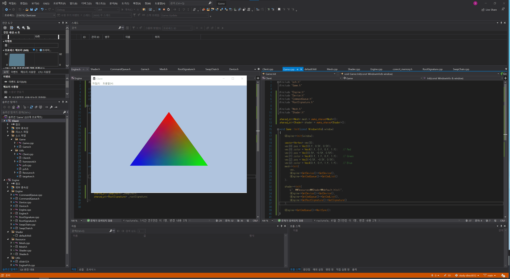 |

---

## Constant Buffer

---

## Root Signature

---

## Index Buffer

---

## Texture Mapping

---

## Depth Stencil View

---
