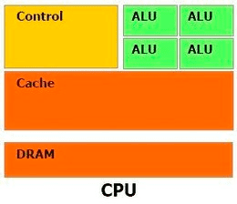
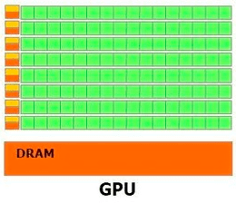
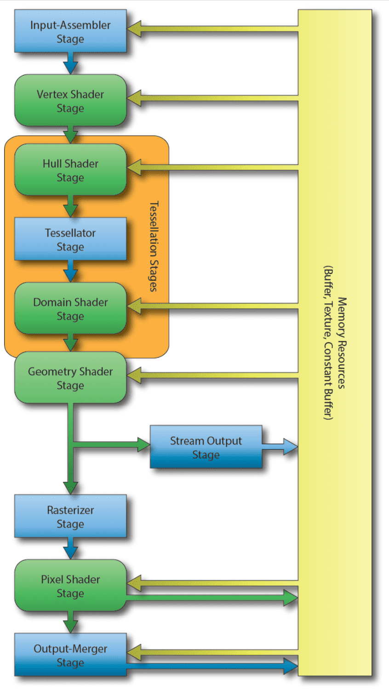

Table of Contents

- [OT](#ot)
- [그래픽스 OT](#그래픽스-ot)
- [렌더링 파이프라인 OT](#렌더링-파이프라인-ot)

---

## OT

|            Motivation            |
| :------------------------------: |
|  |

- 면접 질문들

  > 아래와 같은 질문에 대한 답을 이 강의를 수강하면서 자연스럽게 알게 된다.

  - 렌더링 파이프라인?
  - Diffuse, Ambient, Specular?
  - Double Buffering?
  - Tangent Space?
  - 그림자 원리?
  - 짐벌락 현상은?
  - Quaternion?

---

## 그래픽스 OT

- 그래픽스?
  > 컴퓨터를 이용해 화면에 영상을 만들어 내는 기술
- 게임 화면이 2D 임에도 불구하고 3D 로 보이는 이유?
  > 원근법, 그림자 등 적용이 되므로 3D 공간으로 인식한다.
- `게임 클라이언트`는 `영화 촬영`과 비교된다.

  > 게임:수학적 공식과 물리 법칙의 연산으로 최종 게임을 완성.
  >
  > 영화: 빛이 반사되고 카메라에 상이 맺힌 상이 디지털 신호(= 영상)로 완성.

  | 게임 클라이언트   | 영화 촬영  |
  | :---------------- | :--------- |
  | Lighting          | 조명       |
  | Scene view(Unity) | 세트장     |
  | GameObject        | 배우, 물품 |
  | Script            | 대본       |
  | 게임              | 영화       |

---

## 렌더링 파이프라인 OT

- 모든 3D 게임 오브젝트는 `삼각형` 단위로 만들어진다.

- CPU : GPU

  | CPU                                           | GPU                                           |
  | :-------------------------------------------- | :-------------------------------------------- |
  | 고급 인력                                     | 외주                                          |
  | 범용적, 복잡한 연산 담당                      | 독립적, 반복적, 간단한 연산 담당              |
  | ALU(산술연산장치) 적다                        | ALU(산술연산장치) 많다                        |
  |  |  |

- 게임(그래픽스) 연산을 GPU에 넘기면 좋은 이유?

  > 게임 오브젝트 변환은 (라이팅 계산을 제외하면) 독립적인 연산이다.
  >
  > ex. 좌표 계산, 재질 매핑

### DirectX 12

- Direct X
  > Microsoft 에서 제공하는 GPU 작업을 위한 라이브러리
  >
  > GPU도 제조사마다 사양과 환경이 다르기 때문에 필요하다. 따라서, 우리는 GPU 작업을 위해 Direct X 라이브러리를 사용하고 GPU 제조사는 Microsoft와 협력해서 GPU를 제작한다.
- 렌더링 파이프라인

  |               DirectX 12의 렌더링 파이프라인                |
  | :---------------------------------------------------------: |
  |  |

  | Stage                                                              | 설명                                         |
  | :----------------------------------------------------------------- | :------------------------------------------- |
  | `Input Assembler` Stage                                            | 정점 정보 전달                               |
  | `Vertex Shader(VS)` Stage                                          | 정점 연산 처리                               |
  | `Tesselator` Stages: `Hull Shader`, `Tessellator`, `Domain Shader` | 거시적으로 새로운 정점들을 추가(from. DX11)  |
  | `Geometry Shader` Stage                                            | 좀 더 작은 단위로 정점들을 추가(from. DX10)  |
  | `Rasterizer` Stage                                                 | 정점들 사이의 픽셀들을 보간(여기부터 삼각형) |
  | `Pixel Shader` Stage                                               | 픽셀들의 색상 변경                           |
  | `Output-Merger` Stage                                              | 모든 데이터를 결합해 최종 색상을 결정        |

---
